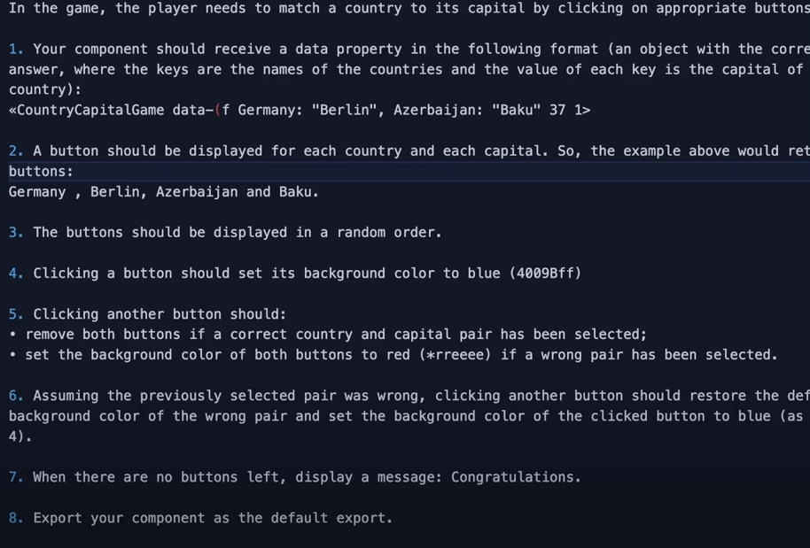

# Country Capital Matching Game

This is a basic implementation of a country/capital matching game using [React](https://reactjs.org/) and [Astro](https://astro.build). The user is presented with a list of countries and capital cities to be matched. See the instructions I followed to complete the project in this image:

